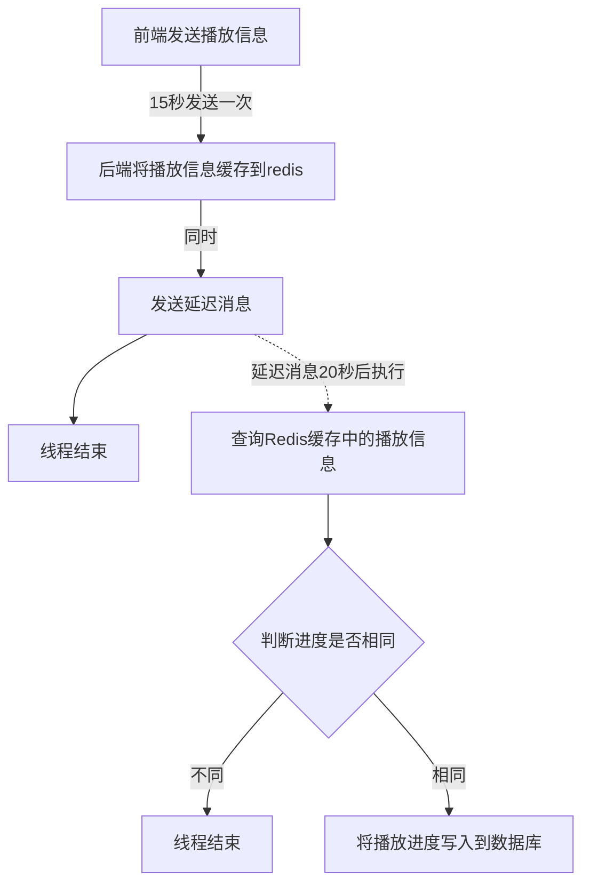

1-12 演讲

# 如何记录视频的播放进度?

#### 记录视频的播放进度，我们采用的方案是：

​	前端每隔15秒发送一次携带当前播放进度的请求到后端，后端将播放进度保存到数据库。

#### 具体流程：

1. 前端发送请求到后端
1. 后端将播放进度信息缓存到Redis，同时用RabbitMQ发送一条延迟20秒的延迟消息，消息内容为播放进度信息
3. 当消费者收到延迟消息后，检查Redis中缓存的播放信息与延迟消息中的播放信息是否相同，
   - 信息不同：说明前端还在提交信息到后端，这种情况无需处理
   - 信息相同：说明前端没有再提交新的播放进度到后端，此时就将Redis中缓存的播放进度写入到数据库

通过上面的三个步骤就完成了视频播放进度保存到数据库的需求。

